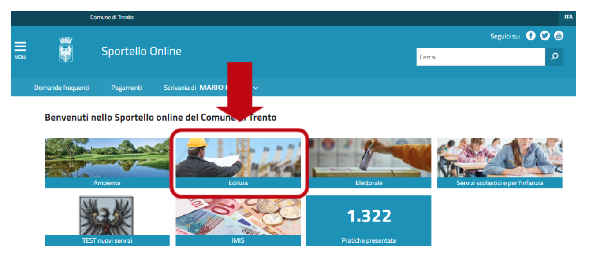

3. Pratiche Edilizie (Sezione Edilizia)
=======================================

Questa sezione dello Sportello è dedicata ai servizi e ai moduli
disponibili in materia di edilizia.

Selezionando questa tematica comparirà l’elenco dei diversi servizi per
il cittadino in materia.

|image0|

Selezionando il servizio di interesse si apre la pagina con tutte le
relative informazioni.

Nello specifico nell’area tematica edilizia troverai i seguenti servizi:

-  **Accesso e consultazione di atti e documenti in materia edilizia**

-  **Comunicazione di inizio lavori**

-  **Richiesta autorizzazione o parere obbligatorio in materia di tutela
   del paesaggio**

-  **Richiesta elenco titoli edilizi**

-  **Segnalazione certificata di inizio attività (Scia)**

